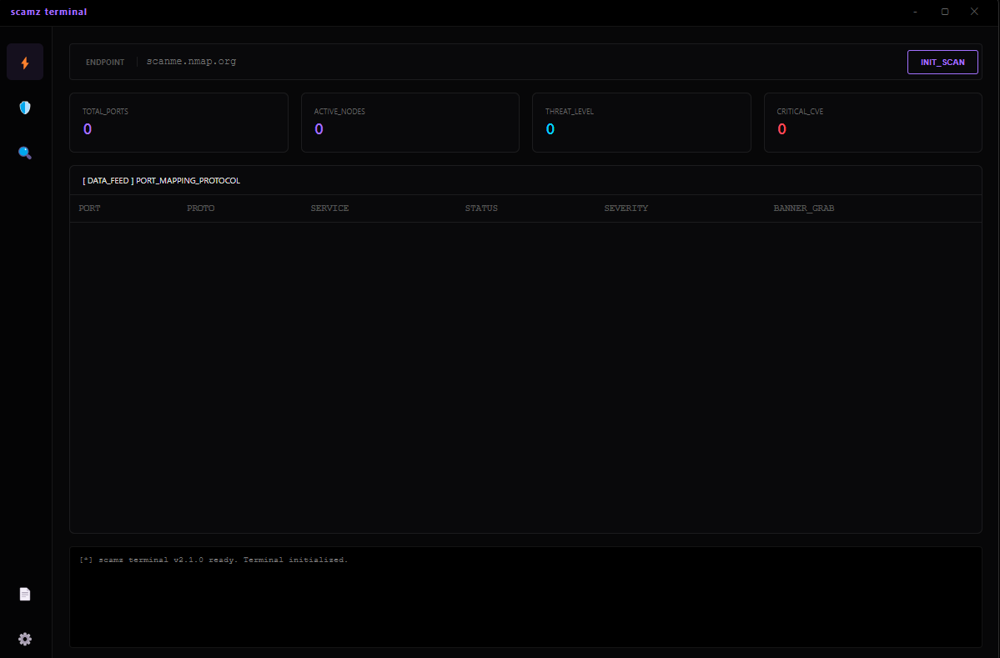
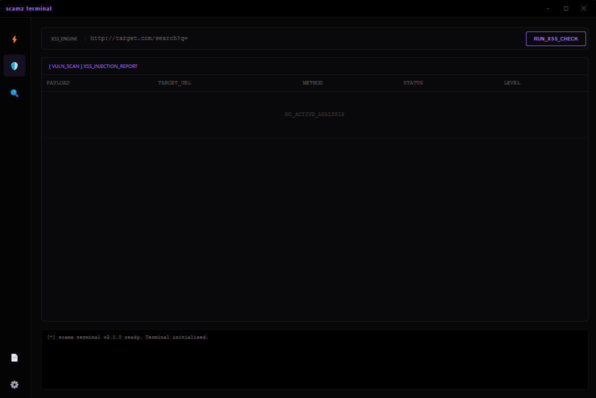
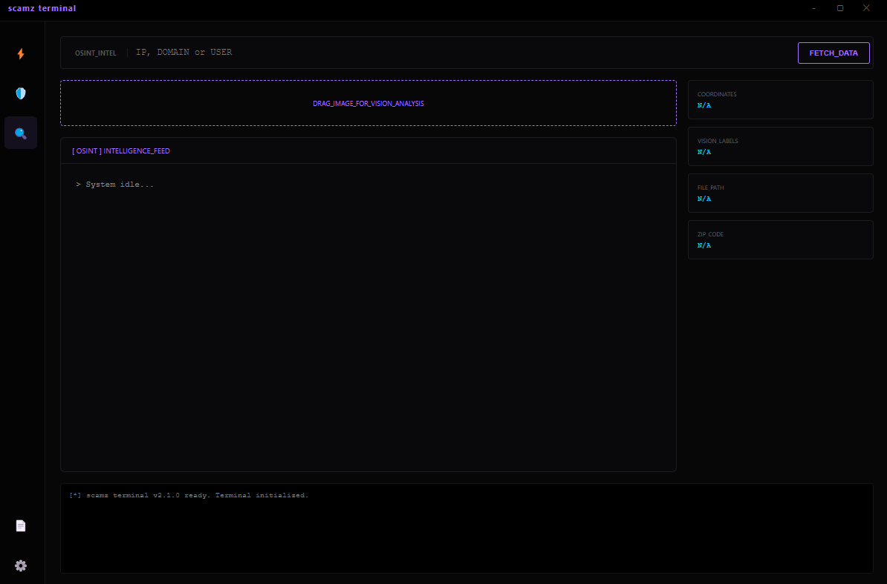
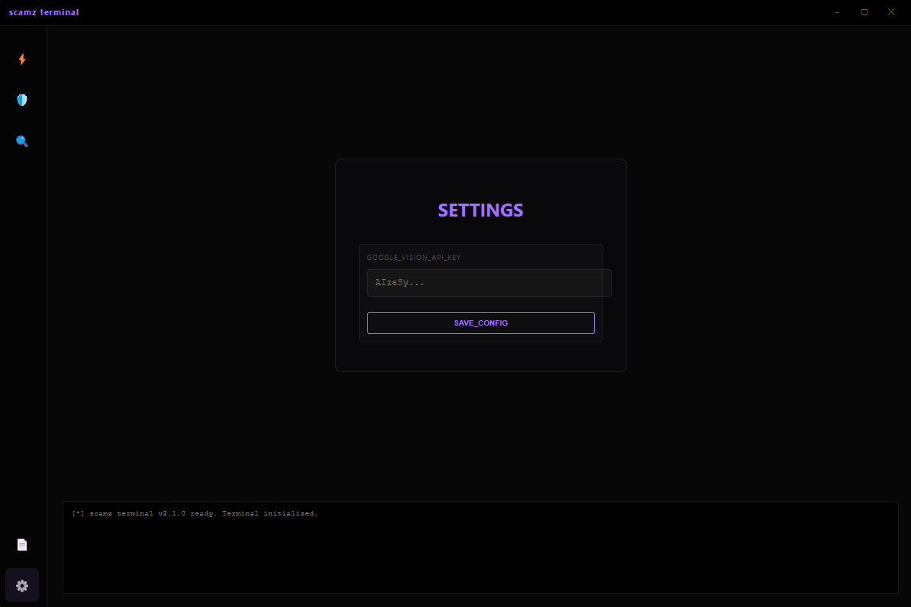

# ⚡ Scamz Terminal 0x1


> Un terminal d'outils de sécurité, de vulnérabilité et d'OSINT avancé, doté d'une interface graphique moderne et intuitive.

---

## 🖥️ Aperçu de l'Interface Principale

Le Scamz Terminal offre un tableau de bord centralisé pour lancer rapidement vos analyses.



---

## 🛠️ Fonctionnalités Clés

### 🛡️ 1. Network Scanner (Nmap Integration)
Un scanner de ports puissant basé sur Nmap, affichant les ports ouverts, les services, les versions et une estimation du niveau de menace.


### 🧩 2. XSS Vulnerability Engine
Un moteur dédié à la détection de vulnérabilités Cross-Site Scripting (XSS). Entrez l'URL cible et analysez les vecteurs d'injection potentiels.



### 🔍 3. OSINT Intel & AI Vision
Le cœur de la reconnaissance. Cette section regroupe :
- **OSINT Intel** : Recherche d'informations sur IP, Domaine ou Utilisateur.
- **AI Vision Analysis** : Un module révolutionnaire où vous pouvez glisser-déposer une image. L'IA analyse l'image pour tenter de l'identifier (nécessite une configuration API).



---

## 🚀 Installation & Configuration

```bash
# Cloner le projet
git clone [https://github.com/ScamzUHQ0x1/scamz-terminal.git](https://github.com/ScamzUHQ0x1/scamz-terminal.git)

# Aller dans le dossier
cd scamz-terminal

# Installer les dépendances
npm install
```

### 🔑 Configuration de la clé AI (Google Vision)

Pour activer le module "AI Vision Analysis", vous devez fournir votre propre clé API Google Cloud Vision.



1. **Accédez aux Paramètres** : Cliquez sur l'icône de rouage en bas à gauche.
2. **Entrez la clé** : Collez votre clé dans le champ `GOOGLE_VISION_API_KEY`.
3. **Sauvegardez** : Cliquez sur `SAVE_CONFIG`.

---

## 📂 Structure du projet

  - `bin/nmap` : Binaires et scripts Nmap requis.
  - `src/` : Code source de l'interface graphique (React/Electron).
  - `main.py` : Moteur backend Python pour les outils de sécurité.


⭐ *N'hésite pas à laisser une star si ce projet t'est utile !*